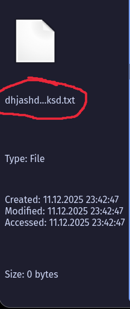

# FileManagerCpp

**FileManagerCpp** is a file manager written in C++/Qt.  

---

## 📝 Change Log

- 🔹 Fixed missing filename in file information 
- 🔹 Added item count display in directories on file information
- 🔹 Resized icon in file information
  
---

## 📷 Screenshots

|  |  |  |
|:---------------------------------------:|:---------------------------------------:|:---------------------------------------:|
| Screenshot 1 | Screenshot 2 | Screenshot 3 |
---

## ⚙️ How to Use

### Linux

**1 Install dependencies:**  
```bash
sudo apt install qt5-base    # for Debian/Ubuntu
# or
sudo pacman -S qt5-base      # for Arch Linux
```

**2 Clone the repository:**
```bash
git clone https://github.com/ArchLinuxUserIgor/FileManagerCpp.git
cd FileManagerCpp
```

**3 Build the project:**
```bash
qmake
make -j<N>   # Replace <N> with the number of threads you want to use
```

**4 Run the application:**
```bash
./fileManager
```

**5 Optional: Install as a system-wide binary:**
```bash
sudo make install
```
Add `/opt/fileManager/bin/` to your `$PATH` to run it from anywhere.

**Windows**

❌ Currently **not supported.**
Windows support will be implemented **soon in a separate repository.**
