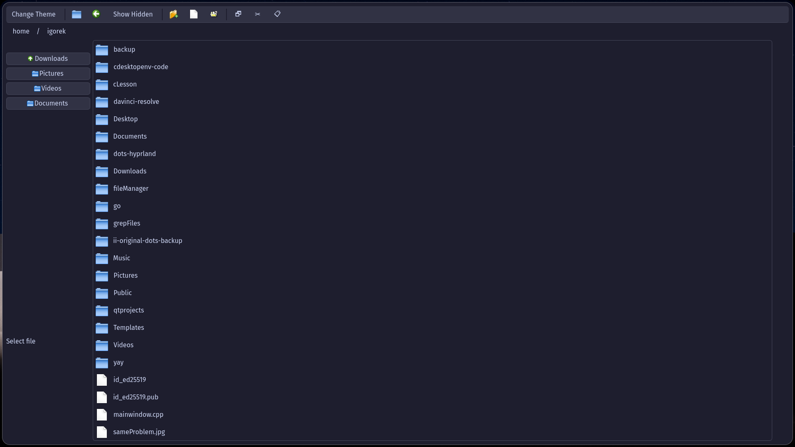
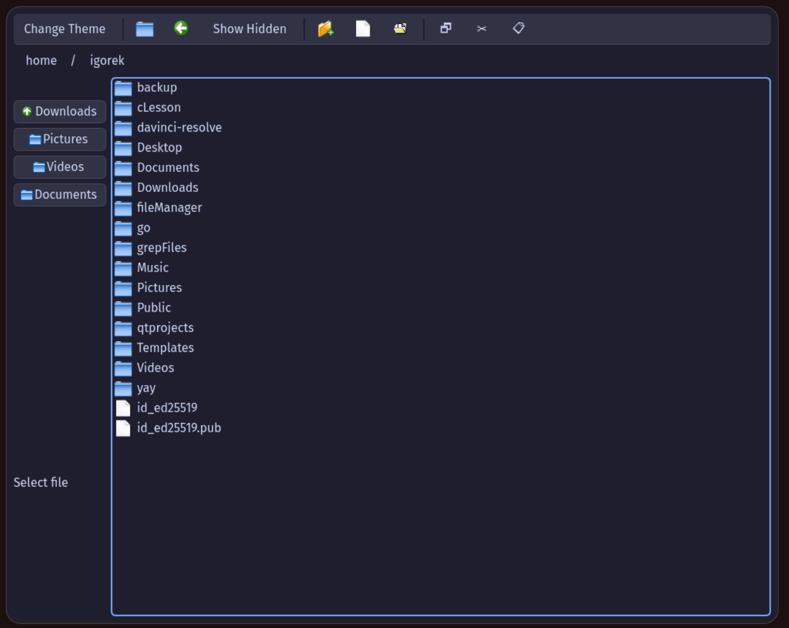

# FileManagerCpp

**FileManagerCpp** is a file manager written in C++/Qt.  


## 📝 Change Log

✅ Fixed "Cut" functionality: The "Cut" operation now works correctly and without errors.  

✅ Improved error messages: Fixed duplicated or malformed error texts (e.g., “Move failed failed”).  

✅ Multi-file operations: You can now copy, delete, or move multiple files at once.  

✅ Accurate selection width: Item selection now matches the actual filename width instead of spanning the entire window.  

✅ Multi-select support: Hold Ctrl and left-click to select multiple items.  

✅ Delete key support: File deletion via the Delete key should now work.  

✅ Enhanced Drag & Drop:  

    🔹Dragging files into a terminal now pastes their paths (as plain text).  
    🔹Dragging within the file manager performs a move operation (not a copy).

✅ Smoother UI interactions:  

    🔹Directory navigation is now visually smoother.  
    🔹Context menus appear with a more fluid animation.

## 📷 Screenshots

|  |  |
|:--------------------------------------:|:--------------------------------------:|
| Screenshot 1                           | Screenshot 2                           |

## ⚙️ How to Use

### Linux

**1 Install dependencies:**  
```bash
sudo apt install qt5-base    # for Debian/Ubuntu
# or
sudo pacman -S qt5-base      # for Arch Linux
```

**2 Clone the repository:**
```bash
git clone https://github.com/ArchLinuxUserIgor/FileManagerCpp.git
cd FileManagerCpp
```

**3 Build the project:**
```bash
qmake
make -j<N>   # Replace <N> with the number of threads you want to use
```

**4 Run the application:**
```bash
./fileManager
```

**5 Optional: Install as a system-wide binary:**
```bash
sudo make install
```
Add `/opt/fileManager/bin/` to your `$PATH` to run it from anywhere.

**Windows**

❌ Currently **not supported.**
Windows support will be implemented **soon in a separate repository.**
